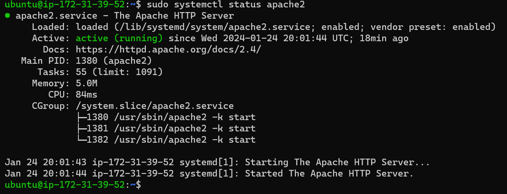

## Documentation of Project 1

`sudo apt update`

`sudo apt install apacahe2`

`sudo systemctl apache2`

[Open SSH Server Installation](https://learn.microsoft.com/en-us/windows-server/administration/openssh/openssh_keymanagement#host-key-generation)

[Markdown Cheatsheet](https://www.markdownguide.org/cheat-sheet/)
